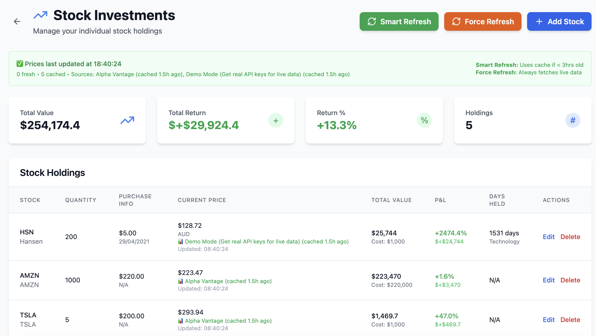

# PortfolioSync

A comprehensive full-stack investment tracking platform for modern investors. Sync all your investments in one intelligent dashboard.

## 📸 Screenshots

### Dashboard Overview

*Clean, modern dashboard showing portfolio overview with real-time values and performance metrics*

### Stock Tracking

*Advanced stock tracking with smart price caching, P&L calculations, and manual refresh controls*

## Features

- **Portfolio Management**: Create and manage multiple investment portfolios
- **Multi-Asset Support**: Track stocks, ETFs, and real estate properties
- **Real-time Price Updates**: Automatic price updates for financial instruments
- **Performance Analytics**: Detailed charts and performance metrics
- **Responsive Design**: Modern UI that works on desktop and mobile

## Architecture

### Frontend (Next.js on S3 + CloudFront)
- Static React application hosted on S3
- CloudFront CDN for global distribution
- TypeScript for type safety
- Tailwind CSS for styling
- Recharts for data visualization
- React Query for state management

### Backend (AWS Lambda + API Gateway)
- Serverless functions via AWS Lambda
- API Gateway for HTTP endpoints
- DynamoDB for data storage
- Scheduled price updates via EventBridge
- RESTful API design

## Project Structure

```
investment-tracker/
├── README.md
├── .env.example
├── docker-compose.yml
├── frontend/                 # Next.js frontend
│   ├── src/
│   │   ├── components/       # React components
│   │   │   ├── dashboard/    # Dashboard components
│   │   │   ├── charts/       # Chart components
│   │   │   ├── tables/       # Table components
│   │   │   └── ui/           # UI components
│   │   ├── pages/            # Next.js pages
│   │   ├── hooks/            # Custom React hooks
│   │   ├── services/         # API services
│   │   ├── utils/            # Utility functions
│   │   └── types/            # TypeScript types
│   ├── public/               # Static assets
│   ├── package.json
│   ├── next.config.js
│   └── .env.example
├── backend/                  # AWS Lambda backend
│   ├── functions/            # Lambda functions
│   │   ├── portfolio/        # Portfolio CRUD operations
│   │   ├── properties/       # Property management
│   │   ├── stocks/           # Stock management
│   │   ├── etfs/             # ETF management
│   │   └── prices/           # Price update functions
│   ├── shared/               # Shared utilities
│   │   ├── database/         # Database connections
│   │   ├── services/         # Business logic
│   │   └── utils/            # Helper functions
│   ├── serverless.yml        # Serverless configuration
│   ├── package.json
│   └── .env.example
└── scripts/                  # Setup and deployment scripts
    ├── setup.sh
    └── deploy.sh
```

## Quick Start

### Prerequisites

- Node.js 18+
- npm or yarn
- AWS CLI configured with appropriate permissions
- Serverless Framework

### Installation

1. **Clone and setup the project:**
   ```bash
   git clone <repository-url>
   cd investment-tracker
   ./scripts/setup.sh
   ```

2. **Configure AWS credentials:**
   ```bash
   aws configure
   ```

3. **Get API keys:**
   - Alpha Vantage: https://www.alphavantage.co/support/#api-key
   - Finnhub: https://finnhub.io/register
   - Update the `.env` files with your API keys

4. **Deploy to AWS:**
   ```bash
   ./scripts/deploy.sh
   ```

5. **For local development:**
   ```bash
   # Terminal 1 - Backend
   cd backend
   npm run offline
   
   # Terminal 2 - Frontend  
   cd frontend
   npm run dev
   ```

### Access the Application

- **Production**: Your CloudFront URL (displayed after deployment)
- **Local Frontend**: http://localhost:3000
- **Local Backend API**: http://localhost:3001

## Deployment

The application uses a fully serverless AWS architecture:

- **S3**: Static website hosting for the frontend
- **CloudFront**: CDN for global content delivery
- **API Gateway**: HTTP API endpoints
- **Lambda**: Serverless compute for business logic
- **DynamoDB**: NoSQL database for data storage
- **EventBridge**: Scheduled price updates

### Automatic Deployment

```bash
# Deploy everything at once
./scripts/deploy.sh
```

This script will:
1. Deploy backend infrastructure (Lambda, API Gateway, DynamoDB)
2. Create S3 bucket and CloudFront distribution
3. Build and deploy the frontend
4. Configure all necessary permissions and policies

### Manual Deployment

```bash
# Backend only
cd backend
serverless deploy

# Frontend only (after backend is deployed)
cd frontend
npm run build
npm run deploy
```

## API Endpoints

### Portfolios
- `GET /portfolios` - List all portfolios
- `GET /portfolios/{id}` - Get portfolio details
- `POST /portfolios` - Create new portfolio
- `PUT /portfolios/{id}` - Update portfolio
- `DELETE /portfolios/{id}` - Delete portfolio

### Stocks
- `GET /portfolios/{portfolioId}/stocks` - List stocks in portfolio
- `POST /portfolios/{portfolioId}/stocks` - Add stock to portfolio
- `PUT /stocks/{id}` - Update stock
- `DELETE /stocks/{id}` - Remove stock

### ETFs
- `GET /portfolios/{portfolioId}/etfs` - List ETFs in portfolio
- `POST /portfolios/{portfolioId}/etfs` - Add ETF to portfolio
- `PUT /etfs/{id}` - Update ETF
- `DELETE /etfs/{id}` - Remove ETF

### Properties
- `GET /portfolios/{portfolioId}/properties` - List properties in portfolio
- `POST /portfolios/{portfolioId}/properties` - Add property to portfolio
- `PUT /properties/{id}` - Update property
- `DELETE /properties/{id}` - Remove property

### Prices
- `GET /prices/{symbol}/history` - Get price history for symbol

## Development

### Frontend Development
```bash
cd frontend
npm run dev          # Start development server
npm run build        # Build for production
npm run lint         # Run ESLint
npm run type-check   # TypeScript type checking
```

### Backend Development
```bash
cd backend
npm run offline      # Start serverless offline
npm run deploy       # Deploy to AWS
npm run remove       # Remove from AWS
npm test            # Run tests
npm run lint        # Run ESLint
```

## Contributing

1. Fork the repository
2. Create a feature branch
3. Make your changes
4. Add tests if applicable
5. Submit a pull request

## 📋 Documentation

- **[Features](FEATURES.md)** - Complete feature list and capabilities
- **[Roadmap](ROADMAP.md)** - Product roadmap and feature backlog
- **[Brand Guidelines](BRAND.md)** - Brand identity and SaaS positioning
- **[Cost Optimization](COST_OPTIMIZATION.md)** - AWS cost monitoring and optimization

## 🎯 Project Management

- **[GitHub Issues](https://github.com/rtananthan/portfoliosync/issues)** - Feature backlog and bug tracking
- **[GitHub Projects](https://github.com/rtananthan/portfoliosync/projects)** - Development progress and milestones

## License

This project is licensed under the MIT License.